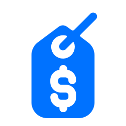

<h1 id="goprom-top" align="center">GoProm</h1>

<div align="center">
    <a href="#"></a>
    <p align="center">
        Promotions API
        <br />
        <br />
        <a href="docs/adrs"><strong>ADRs</strong></a> · 
        <a href="https://github.com/vitorsalgado/goprom/actions/workflows/ci.yml"><strong>CI</strong></a> 
    </p>
    <div>
      <a href="https://github.com/vitorsalgado/goprom/actions/workflows/ci.yml">
        
      </a>
      <a href="#">
        
      </a>
      <a href="https://conventionalcommits.org">
        
      </a>
    </div>
</div>

## Overview

GoProm periodically load promotions into Redis and expose the data via an HTTP API. It's composed by two applications
that run separately: **api** and **loader**.  
The `api` simple expose an endpoint to query promotions by id.  
The `loader` reads a **csv** file in a specific path, by default **data**, and sends all data to Redis. It's triggered
by a `cron`.
The `loader`workflow is the following:

- a `crontab` executes the `loader` every 1 minute.
- the `loader` checks if there's any new promotions.csv file in the specified directory.
- no promotions file, it will exit.
- found a promotions file, now it'll read the promotions and stream each entry to Redis, including a configurable
  expiration time.
- the `promotions.csv` file will be renamed, including a suffix `DATETIME--imported.csv`.

## Getting Started

### Prerequisites

- Go 1.18
- Docker
- Docker Compose

### Configuration

This project uses environment variables for configuration. See [.env.sample](.env.sample) for more details.

### Running

To execute a local environment with both the `loader`, the `api` and `Redis`, run:

```
make up
```

### Processing Promotions

With the application running, in order to process new promotions, add the **promotions.csv** file to the directory
**data** at the project root dir. After some time, the **loader** application will identify this file and start
the process automatically.  
To query one promotion, use the following command:

```
curl http://localhost:8080/promotions/d018ef0b-dbd9-48f1-ac1a-eb4d90e57118
```

## Development

Check the [Makefile](Makefile) for more details.  
Execute the following command to see the Makefile help:

```
make
```

### Tools

- Node.js
- Air
- Adr Tools
- Staticcheck
- Husky
- Commit Lint

## Tests

### Unit Tests

To execute all unit tests, run:

```
make test
```

### End-to-End Tests

The end-to-end test available runs a docker-compose environment first, and then the tests scripts.  
Run:

```
make test-e2e
```

## Built With

Main libraries and tools used in this project:

- Docker
- Docker Compose
- Redis
- [godotenv](https://github.com/joho/godotenv)
- [Zerolog](https://github.com/rs/zerolog)
- [go-env](https://github.com/Netflix/go-env)
- [go-redis](https://github.com/go-redis/redis)

## Contributing

See [CONTRIBUTING.md](CONTRIBUTING.md) for more details.

---

## Considerations and Thoughts

- To improve the CSV processing performance, a group of goroutines are used, instead of just one in the previous
  implementation. Each goroutine writes in its own bulk load commands file and several loads are being done in parallel
  now.
- Promotions will be removed by Redis using the Expiration feature. For every promotion imported, a configurable
  expiration time is set as well.
- For an ideal solution, the application should have:
    - centralized log solution
    - monitoring solution
    - metrics
    - deployment should be made using solutions like Kubernetes, which facilitates configuration and scaling when needed
    - ideally, the Redis should be operated as a cluster to horizontally scale it and increase availability

<p align="center"><a href="#goprom-top">back to top</a></p>
